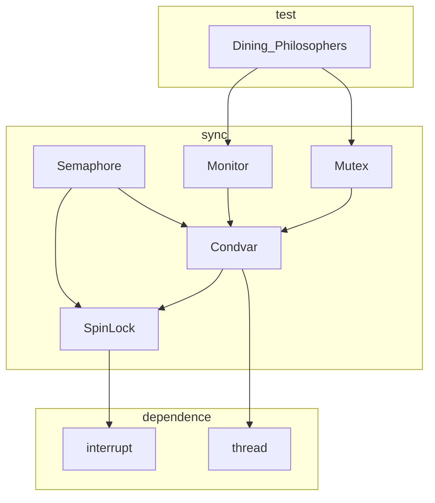

```mermaid
graph TB
   subgraph dependence
       interrupt
       thread
   end
   subgraph sync
       SpinLock --> interrupt
       Condvar --> SpinLock
    Condvar --> thread
    Mutex --> Condvar
       Monitor --> Condvar
       Semaphore --> Condvar
       Semaphore --> SpinLock
   end
   subgraph test
       Dining_Philosophers --> Mutex
       Dining_Philosophers --> Monitor
   end
```
